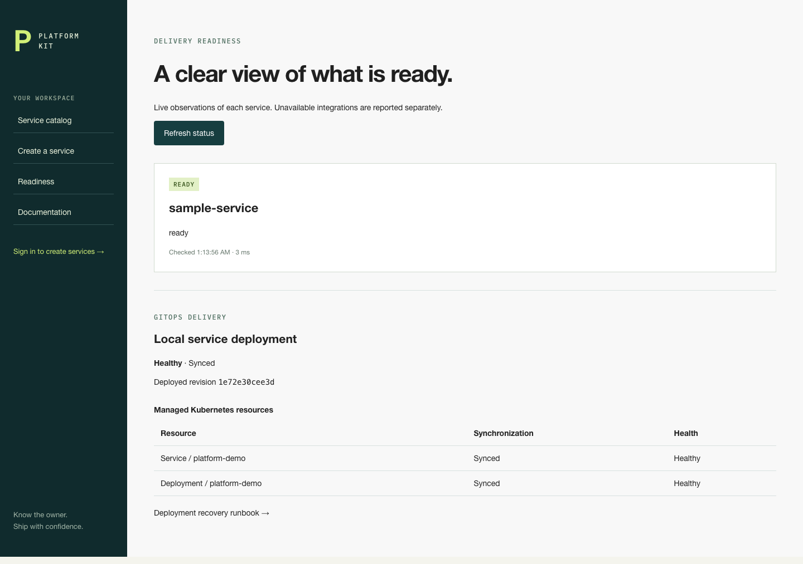

# Developer Platform Kit

A Backstage developer portal for finding service ownership, generating working services, and understanding delivery readiness. It combines an actual Backstage catalog backed by PostgreSQL with Node/TypeScript and ASP.NET Core 6 templates, Keycloak sign-in, and a local Kubernetes/Argo CD delivery environment.



## What works

- Browse owners, systems, lifecycle and dependency relations in the Backstage catalog.
- Preview and generate either service stack from the portal or CLI. Each project includes working HTTP APIs, executable tests, OpenAPI, catalog registration metadata, CI, a non-root container and Kubernetes probes/resources.
- Sign in through real Keycloak authorization-code flow with PKCE. Developer accounts can generate services; viewer and anonymous writes are rejected.
- Inspect independent HTTP readiness observations and actual Argo CD application/resource state. Integration failures leave unrelated portal functions available.
- Detect managed-file drift, preview upgrades and apply them with full recoverable backups, including custom files and repository metadata.
- Deploy a generated service to kind, detect live drift, reject an unavailable rollout, roll back a verified revision and restore desired Git state.

## Start the portal

Prerequisites: Node 16, npm, Git, Python 3, curl and Docker. The hosted workflow uses Node 16.16.0; generated Node containers use 16.13.1. Ports 4600, 4610 and 4612 must be free.

```sh
npm ci --legacy-peer-deps --ignore-scripts --no-audit --no-fund
node node_modules/esbuild/install.js
python3 scripts/install-dotnet.py
npm run build
docker compose -p platform-kit up -d catalog-db keycloak
```

Keycloak's first startup can take about three minutes on Apple Silicon. Wait until this discovery request succeeds, then initialize the local realm and start the portal:

```sh
curl --fail http://localhost:4610/realms/master/.well-known/openid-configuration
node scripts/init-identity.js
npm start
```

Open **http://localhost:4600**. Use `localhost`, matching the registered OIDC callback. Local fixtures are `developer` / `developer-local-only` and `viewer` / `viewer-local-only`. No cloud account or external repository credentials are needed.

The isolated .NET installer verifies Microsoft's SHA-512 archive and preserves an existing tool directory. It supports macOS/Linux on x64/arm64. Linux hosts need the native dependencies for .NET 6; the included SDK container is another route for service verification.

## Generate and upgrade a service

```sh
mkdir -p .generated
node scripts/generate.js --name orders-api --owner platform-team --language node --destination .generated/orders-api
cd .generated/orders-api
npm install --ignore-scripts --no-audit --no-fund
npm test
npm start
```

The service listens on port 4605 and exposes `/health`, `/ready`, `/items` and `/openapi.json`. Use `--language dotnet` for ASP.NET Core. Its generated console acceptance runner starts a real HTTP server: `dotnet run --project tests/Smoke.csproj -c Release`.

From the platform repository, preview an upgrade before applying it:

```sh
node scripts/upgrade.js .generated/orders-api --port 4606
node scripts/upgrade.js .generated/orders-api --port 4606 --apply
```

Conflicting local edits stop the upgrade. The successful command reports a full backup path; preserve that directory until the upgraded service passes its checks.

## Verify and deploy

```sh
npm test
npm run typecheck
npm run build
node scripts/check-services.js
node scripts/check-onboarding.js
```

[Deployment and recovery](docs/operations.md) contains the complete kind/Argo CD sequence. The read-only local Git source is isolated on Docker's kind network. The deployed service is exposed only on `127.0.0.1:4625`. To observe it in the portal, start with `SERVICE_URL=http://127.0.0.1:4625/ready npm start`.

Browser checks live in `tests/browser`. Set `PLAYWRIGHT_MODULE` to an installed Playwright module path and run them with a compatible browser-test Node runtime. Application dependencies remain in the locked Node 16 environment. [Verification evidence](docs/verification.md) records measured results and scope.

## Design and limits

[Architecture decisions](docs/architecture.md), [onboarding](docs/onboarding.md), [identity](docs/identity.md), [API reference](docs/api.md) and [dependency provenance](docs/dependencies.md) explain the operating model.

This is a local developer platform. Demo accounts, memory-backed portal sessions and in-memory generated work items are intentional local defaults. Generated APIs do not include business authorization or persistent storage. A shared deployment requires HTTPS, protected identity/session configuration and workload-specific data/security controls. Hosted GitHub Actions results are separate from the local CI-equivalent checks.

Stop the portal with Ctrl-C and the fixtures with `docker compose -p platform-kit stop`. Kubernetes cleanup is scoped to the owned project cluster as documented in the runbook.

Apache-2.0. Upstream components retain their own licenses; see [third-party notices](docs/third-party-notices.md).
