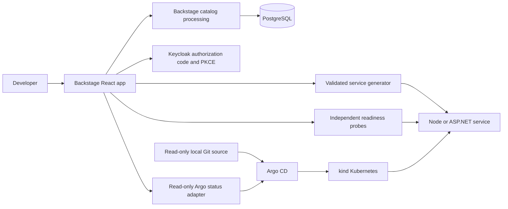

# Architecture decisions

## ADR 1: Use the actual catalog domain

Backstage owns entity processing, catalog storage, ownership/dependency relations and catalog UI. PostgreSQL holds its state. The platform validates its one YAML source before starting the processing engine. Custom code provides service creation and operational views around that catalog; it does not substitute a static catalog facade.

## ADR 2: Treat templates as versioned source inputs

Both templates ship source, real HTTP tests, OpenAPI, CI and container/Kubernetes configuration together. Exact compiler/runtime versions and the complete npm lock make the baseline reproducible. Generated metadata tracks managed-file digests. Upgrades reject conflicting edits and preserve full backups, including custom files and repository metadata.

Output staging and an exclusive destination reservation prevent overwrites. Upgrade publication uses a prepared replacement and restores the original on failure. These are local filesystem operations; callers should avoid editing a project while an upgrade runs.

## ADR 3: Verify identity at the backend boundary

The public OIDC client uses authorization code flow with S256 PKCE. Browser-bound state and nonce are checked once; backend token verification checks RS256 signature, issuer, audience, expiry and subject. Browser sessions hold tokens only in backend memory and use HttpOnly/SameSite cookies. Writes require the developer role; cookie-based writes additionally require the application Origin.

Restarting the portal invalidates its sessions. Upstream role changes become effective when tokens expire or a new login occurs. Shared deployments need persistent protected sessions, HTTPS and environment-specific identity configuration. The generated sample APIs have independent authorization requirements.

## ADR 4: Isolate integration failures

A stalled service probe has a deadline and a bounded response body. Concurrent status refreshes share one request and consumers cannot mutate cached observations. Invalid JSON or malformed health fields produce explicit unavailable/unhealthy state. The browser retains the last successful observations after refresh failure.

Catalog startup/failure does not prevent health, documentation or template preview routes from responding. Deployment status has a separate bounded kubectl call and reports integration unavailability without breaking the catalog.

## ADR 5: Keep local GitOps observable and contained

The dedicated kind cluster uses a project-owned kubeconfig and ownership marker. Argo CD's AppProject allows only Deployments and Services in `platform-demo`, from one local read-only Git source. The source image pins Node and Git; smart HTTP supports Argo's revision discovery without host-loopback forwarding.

Manual synchronization exposes drift before reconciliation. Readiness-gated rolling updates keep the existing healthy replica serving during a failed rollout. Recovery first synchronizes a known revision, then reverts the bad Git commit and syncs again so both live and desired state agree. The acceptance harness exercises each transition against actual controllers.
