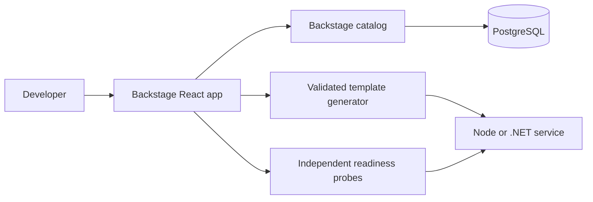

# Architecture decisions

## Isolate optional integrations

Catalog ownership and deployment readiness have different failure domains. A failed service probe produces an unavailable observation; it does not reject a catalog or documentation request. A catalog database failure returns 503 only from its own route.

## Source templates are reproducible inputs

Templates generate complete projects with versioned provenance. Project names and owners use DNS labels. Files are created in a sibling staging directory and renamed into place. Existing destinations are protected. The portal chooses its workspace; callers cannot submit arbitrary filesystem destinations.

## Separate liveness from readiness

Liveness reports that the process can answer. Readiness also honors draining and explicit unavailable state. Kubernetes should send traffic only to ready workloads and allow existing requests to finish before process exit.
